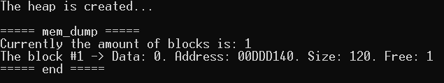
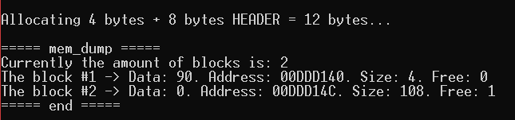
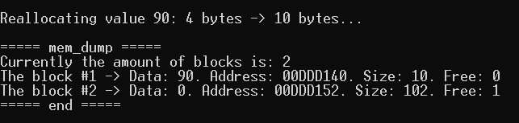
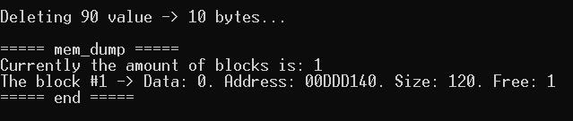

# MemoryAllocatorLabOS1
A simple memory allocator written on C++
## Опис
### Короткий опис програми
Тест реалізації основної механіки роботи аллокатора пам'яті.
Алгоритм припускає, що ми маємо безперервну частину пам’яті. Там ми можемо виділити різні ** блоки **. Функція використовує арифметику покажчика для переміщення між блоками.

Кожен блок має ** header ** та ** data **. ** Header ** завжди має фіксований розмір 8 байт.
Це означає, що для виділення *** 10 байт *** пам'яті нам потрібно щонайменше *** 18 байт *** вільної пам'яті.
Структура ** Header **:
> **[current block size : 2 bytes | previous block size : 2 bytes | data is occupied : 1 byte | placeholder : 3 bytes]**
### Опис алгоритму   
#### `void* mem_alloc(size_t size)` функція
Коли викликана функція `mem_alloc`,
він шукає найменший блок вільної пам'яті, що відповідає критеріям `size` (розмір цього вільного блоку повинен бути принаймні` size + HEADER_SIZE`).
Якщо він знайшов такий - він розбиває блок на блок "прийнято для виділення пам'яті" та блок "вільна пам'ять залишилася".
Якщо цього не сталося - він повертає `nullptr`.
#### `void* mem_realloc(void* addr, size_t size)` функція
Цей виклик функції перш за все вирішує, що йому потрібно зробити: блок меншим або більшим.

** Якщо меншим **, поточний блок пам'яті буде розділений на дві частини: блок "нові дані" та блок "звільненої пам'яті".
Потім викликається функція `mem_free` (туди як аргумент передається поінтер блоку" звільненої пам'яті ").
    
** Якщо більшим **, перш за все, його аналізують, якщо блок пам'яті може «перелитися» на сусідній блок вільної пам'яті
  (якщо вони існують). Якщо це неможливо, викликається функція `mem_alloc`, щоб знайти вільний блок пам'яті з достатньою кількістю вільної пам'яті, а дані копіюються
до нового блоку. Дані старого блоку видаляються, `mem_free` викликається зі старим покажчиком даних блоку, переданим як аргумент.
#### `void mem_free(void* addr)` функція
Функція видаляє дані блоку, позначає його як блок "вільної пам'яті" та намагається об'єднати із сусідніми блоками "вільної пам'яті", якщо вони є.

## Результат роботи

> Всі виходи стану пам'яті виконуються за допомогою функції `mem_dump`, яка, в основному, проходить через" нашу "HEAP і друкує стани всіх існуючих блоків.
##### Код
```  
MemoryAllocator allocator;     
   
allocator.mem_dump();    
```
##### Вивід

##### Code
```
int* test1;
test1 = (int*)allocator.mem_alloc(sizeof(int));    
*test1 = 90;    
   
allocator.mem_dump();    
```
##### Вивід


##### Код
```
test1 = (int*)allocator.mem_realloc(test1, 10);    
   
allocator.mem_dump();    
```
##### Вивід

#### Виклик `mem_free` для раніше створеного блоку пам'яті.
##### Код
```
allocator.mem_free(test1);    
   
allocator.mem_dump();    
```
##### Output

